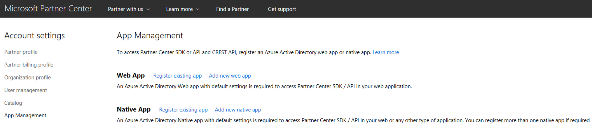
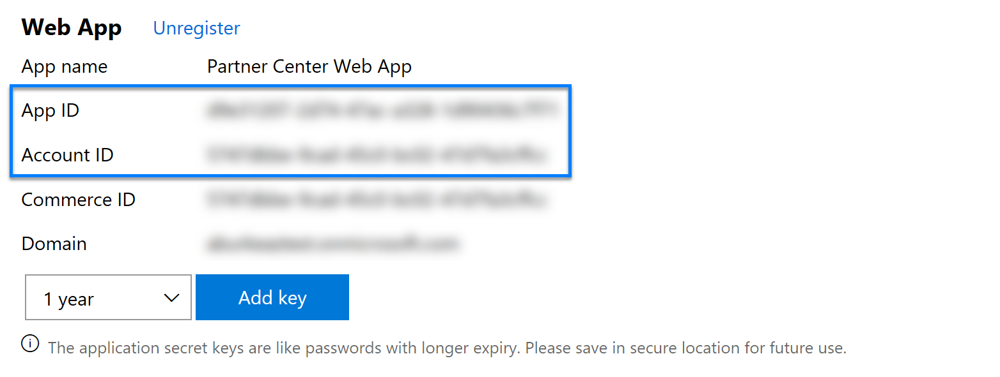
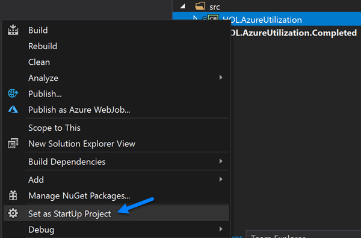
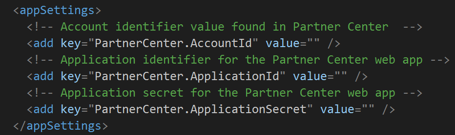

# Azure Utilization Hands on Lab
In this lab you will learn how to query the Partner Center API/SDK to obtain Azure rate card details and utilization records for a specified subscription. 

## Prerequisites

* Visual Studio 2017

## Task Overview 

1. Get the source code 
2. Provision an Azure AD application that can be utilized when communicating with the Partner Center API.
3. Update the application configuration values found in the *App.config* file
4. Complete the following functions 
    * GetAzureRateCard
    * GetAzureUtilization
    * PrintLineItems

## Walkthrough 
### 1. Get the source code

Before you can start working this lab you must clone, or download, the source code from this repository. Perform the following to clone the repository using Visual Studio 2017

1. Open Visual Studio 2017
2. Go to View -> Team Explorer
3. On the Connect page of the Team Explorer window, click the Clone drop-down located under the Local Git Repositories section
4. Enter the URL https://github.com/isaiahwilliams/Azure-Utilization-Labs.git
5. If desired, change the local repository path
6. Click the Clone button 

### 2. Provision an Azure AD app for Partner Center API access

The Partner Center API is protected using Azure AD. In order to utilize the API, or SDK, you must have an application that is correctly configured. Perform the following to create the required application using [Partner Center](https://partnercenter.microsoft.com)

1. Browse to https://partnercenter.microsoft.com and authenticate using credentials that have *AdminAgent* and *Global Admin* privileges
2. Click *Dashboard -> Account Settings -> App Management* 

    

3. Under the web app section slick *Add new app* 

    > **Note**: If an application has already been created you can utilize that application. If you do not know the secret key, you will need to create a new one. 

4. Document the values the below as they will be needed for the next task
    * AccountId
    * App ID

    

5. Click the *Add key* button to create a new key and document it

### 3. Update the Application Configurations

The partially completed source for this lab requires the following three configurations 
* PartnerCenter.AccountId
* PartnerCenter.ApplicationId
* PartnerCenter.ApplicationSecret

Perform the following to configure these settings

1. Open the solution, *Azure-Utilization-Labs.sln*, in Visual Studio 2017
2. Right click on the *Querying* project in the *Solution Explorer* and then click *Set as Startup Project*

     

3. Open *App.config* file found under the *Querying* project
4. Configure the *PartnerCenter.AccountId*, *PartnerCenter.ApplicationId(, and *PartnerCenter.ApplicationSecret* settings 

    

### 4. Complete the Functions 

The partially completed source for this lab provides a foundation that will be built upon. It provides the required code to obtain the necessary access token and it stubs the function you will complete.

#### Complete the GetAzureRateCard Function
The purpose of this function is to return Azure rate card details. It can be found in the *Program.cs* file. In order to complete this function, add the following code

```csharp
IPartner partner;

try
{
    if (correlationId == default(Guid))
    {
        correlationId = Guid.NewGuid();
    }

    partner = GetPartnerService(correlationId);

    return partner.RateCards.Azure.Get();
}
finally
{
    partner = null;
}
```

This code will do the following when it is invoked 
1. Check if a value was passed to the function for the *correlationId* parameter. If a value was not passed a new GUID value will be assigned to the *correlationId* parameter.
2. Obtain an aptly configured instance of the partner service by calling the *GetPartnerService* function. That function will request the required access token and initialize the partner service using that token.
3. Request rate card details from the Partner Center API by invoking the following 
    ```csharp
    partner.RateCards.Azure.Get()
    ``` 
4. Finally the rate card details are returned.

Additional details regarding Azure Rate Card, as it relates to the Cloud Solution Provider program, can be found [here](https://docs.microsoft.com/en-us/partner-center/develop/azure-rate-card). 

#### Complete the GetAzureUtilization Function
The purpose of this function is to obtain Azure utilization records for the specified subscription. Locate the *GetAzureUtilization* function found in the *Program.cs* file and replace the existing code with the following

```csharp
IPartner partner;
IResourceCollectionEnumerator<ResourceCollection<AzureUtilizationRecord>> usageEnumerator;
List<AzureUtilizationRecord> usageRecords;
ResourceCollection<AzureUtilizationRecord> records;

try
{
    ConsoleHelper.Instance.StartProgress("Querying Azure utilization records");

    if (correlationId == default(Guid))
    {
        correlationId = Guid.NewGuid();
    }

    partner = GetPartnerService(correlationId);

    records = partner.Customers.ById(customerId).Subscriptions.ById(subscriptionId).Utilization.Azure.Query(
            DateTimeOffset.Now.AddDays(-7), DateTimeOffset.Now, AzureUtilizationGranularity.Daily, true, 10);

    usageEnumerator = partner.Enumerators.Utilization.Azure.Create(records);
    usageRecords = new List<AzureUtilizationRecord>();

    while (usageEnumerator.HasValue)
    {
        usageRecords.AddRange(usageEnumerator.Current.Items);
        usageEnumerator.Next();
    }

    ConsoleHelper.Instance.StopProgress();

    return usageRecords;
}
finally
{
    partner = null;
    records = null;
    usageEnumerator = null;
}
```

When you request Azure utilization records you must know the identifier for the customer and subscription. Also, you can specify a date range along with what type of utilization records you want returned. *Daily* records provide a single record for each consumed billable resource. Whereas, *hourly* records provide a record for each hour, within the defined interval, for each consumed billable resource. 

By default, the request for Azure utilization records will return the maximum 1000 records for an individual request. It is possible to override this default setting, known as the page size. In the above code snippet, the page size was configured to 10. This was done, so that we could demonstrate how resource enumerators could be leveraged to continue requesting records until all have been returned.

#### Complete the PrintLineItems Function
The function demonstrates how you can combine Azure rate card details with Azure utilization records. Locate the *PrintLineItems* function in the *Program.cs* function and add the following code 

```csharp
List<LineItem> items;

try
{
    ConsoleHelper.Instance.StartProgress("Combining utilization records with rate card details");
    items = new List<LineItem>();

    items = records.Select(r => new LineItem
    {
        Category = r.Resource.Category,
        Id = r.Resource.Id,
        Name = r.Resource.Name,
        Price = rateCard.Meters.Single(m => m.Id == r.Resource.Id).Rates[0] * r.Quantity,
        Quantity = r.Quantity,
        Region = r.Resource.Region,
        ResourceUri = r.InstanceData.ResourceUri,
        Subcategory = r.Resource.Category,
        UsageEndTime = r.UsageEndTime,
        UsageStartTime = r.UsageStartTime
    }).ToList();

    ConsoleHelper.Instance.StopProgress();
    ConsoleHelper.Instance.WriteObject(items);
}
finally
{
    items = null;
}
```

To better understand what the above code is doing, consider the following scenario. You have a customer that has a virtual machine running on Azure. This virtual machine will utilize several billable resources, such as storage. The following JSON represents an utilization returned from the Partner Center API  

```json
{
  "usageStartTime": "2017-12-17T16:00:00+00:00",
  "usageEndTime": "2017-12-18T16:00:00+00:00",
  "resource": {
    "id": "761abab8-259d-4206-a6ae-707ed03fc540",
    "name": "Standard IO - File Read Operation Units (in 10,000s)",
    "category": "Data Management",
    "subcategory": "",
    "region": ""
  },
  "quantity": 0.0008,
  "unit": "10,000s",
  "infoFields": {},
  "instanceData": {
    "resourceUri": "/subscriptions/c0cd09d7-4a31-4d64-a781-8e50a4c4d2eb/resourceGroups/ce1-azure-eastus2-37bb1c-516b/providers/Microsoft.Storage/storageAccounts/osstore37bb1c69f3d443c28",
    "location": "useast2",
    "partNumber": "",
    "orderNumber": "",
    "tags": {
        "costCenter": "HR"
    }
  },
  "attributes": { "objectType": "AzureUtilizationRecord" }
}
```

This record tells us that 0.0008 units of the billable resource has been consumed. To determine the cost for this consumed resource, the utilization record should be combined with the appropriate rate card meter. This is accomplished by locating the meter with an identifier that matches the resource identifier of the consumed resource. The following JSON represents the meter, from the rate card, that matches the utilization record shown above

```json
{
  "id": "761abab8-259d-4206-a6ae-707ed03fc540",
  "name": "Standard IO - File Read Operation Units (in 10,000s)",
  "rates": { "0": 0.001275 },
  "tags": [],
  "category": "Data Management",
  "subcategory": "",
  "region": "",
  "unit": "10,000s",
  "includedQuantity": 0.0,
  "effectiveDate": "2016-08-01T00:00:00Z"
}
```  

To calculate the price, you simply need to multiple the quantity by the appropriate rate. The result from that multiplication will be the cost of the consumed resource at that given point in time. 

 > **Note**: Rate card meters provide real time pricing for Azure resources. These prices are subject to change. It is recommended to track these changes, so that you can correctly calculate the cost of consumed resources over time. 
 
 The above scenario does not cover how to handle any included quantity or tiered pricing. If you would like more details on these topics then please watch [this](https://msuspartner.eventbuilder.com/event?eventid=s4k5p7&source=github) webinar.

## Try It Out

Now that you have completed the functions and set the appropriate configurations you can try it out. When you start the application, it will perform the following 
1. Obtain the Azure Rate Card 
2. Prompt you to enter an identifier for a customer and subscription
3. Obtain the available utilization records for the specified subscription from the past 7 days
4. Combine the utilization records with Azure Rate Card meters and write the result to the console  

If you have an issue with this lab please log an issue using the [issue tracker](https://github.com/Microsoft/Partner-Center-Labs/issues).

## Next Steps

In this lab, you learned how to obtain the Azure Rate Card and utilization records for a specified subscription. Review the following resources to learn more about the operations performed in this lab.
* [Get prices for Microsoft Azure](https://docs.microsoft.com/en-us/partner-center/develop/get-prices-for-microsoft-azure)
* [Get prices for Microsoft Azure Partner Shared Services](https://docs.microsoft.com/en-us/partner-center/develop/get-prices-for-microsoft-azure-partner-shared-services)
* [Get a subscription's resource usage information](https://docs.microsoft.com/en-us/partner-center/develop/get-a-subscriptions-resource-usage-information)